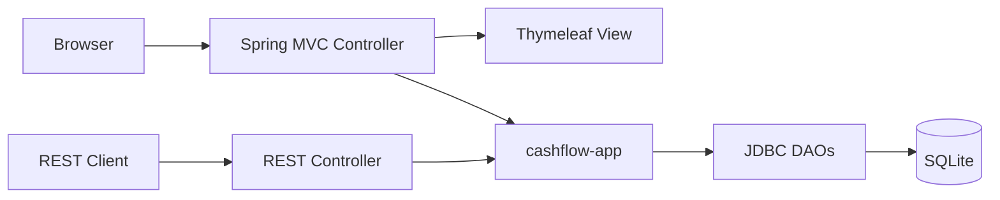
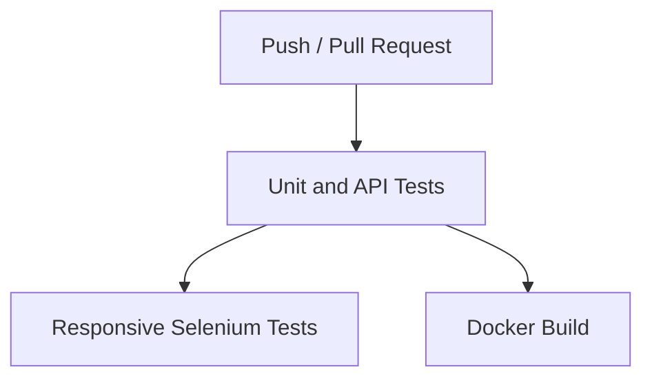

# CashFlow

[](https://github.com/rubensme/cashflow-app-testing/actions/workflows/backend-tests.yml)

CashFlow ist eine Java-/Spring-Boot-Anwendung zur Verwaltung persönlicher Finanzen. Sie unterstützt unter anderem Konten, Transaktionen, geplante Ausgaben, Cashflow-Prognosen, Sparziele und Haushaltsgruppen.

Das Projekt entstand während meiner Umschulung zum Fachinformatiker für Anwendungsentwicklung und wird als praxisorientiertes Lern- und Portfolio-Projekt weiterentwickelt. Der aktuelle Schwerpunkt liegt auf einer nachvollziehbaren Teststrategie mit automatisierten Tests auf mehreren Ebenen.

> **Projektstatus:** Work in Progress. Die Anwendung ist ein Lernprojekt und noch nicht für den produktiven Einsatz vorgesehen.

## Architektur

Das Repository besteht aus zwei getrennten Maven-Modulen:

| Modul | Aufgabe |
| --- | --- |
| `cashflow-app` | Domänenmodelle, Geschäftslogik, Services, JDBC-DAOs, SQLite-Zugriff und Konsolenanwendung |
| `cashflow-web` | Spring-Boot-Webanwendung, MVC- und REST-Controller, Thymeleaf-Templates, CSS/JavaScript sowie Web- und UI-Tests |

`cashflow-web` verwendet `cashflow-app` als Maven-Abhängigkeit. Deshalb muss das Kernmodul vor dem Webmodul gebaut und im lokalen Maven-Repository installiert werden.



## Technologien

- Java 21
- Spring Boot 3.5.4
- Spring MVC und Thymeleaf
- Maven
- JDBC und SQLite
- JUnit 5
- Mockito
- Spring MockMvc
- Selenium WebDriver und Selenium Manager
- Docker
- GitHub Actions

## Teststrategie

Die Tests sind nach Verantwortungsbereich und benötigter Infrastruktur getrennt. Schnell ausführbare Tests bilden die Basis; browserbasierte Tests prüfen ausgewählte Abläufe aus Benutzersicht.

| Testart | Werkzeuge | Prüfschwerpunkt | Beispiele |
| --- | --- | --- | --- |
| Domain Unit Tests | JUnit 5 | Geschäftsregeln ohne Spring und Datenbank | Fälligkeiten, Monatswechsel, Prognoseberechnung |
| Controller Unit Tests | JUnit 5, Mockito | Controller-Verhalten mit isoliertem DAO | erfolgreicher Login, falsches Passwort, Datenbankfehler |
| Spring Integration Tests | `@SpringBootTest`, MockMvc | Application Context und MVC-Verhalten | Laden der Nutzerseite, Validierung leerer Registrierungsfelder |
| Web/API Slice Tests | `@WebMvcTest`, MockMvc, `@MockitoBean` | Request Mapping, HTTP-Status, JSON und Controller-DAO-Interaktion | Status API, Konten API, `401` und `500` |
| Browser UI Tests | Selenium WebDriver | Verhalten im echten Browser | Formulare, Fehlermeldungen und responsives Layout |

Mockito ist dabei kein eigenes Testlevel. Es ersetzt ausgewählte Abhängigkeiten durch kontrollierbare Test Doubles. Dadurch kann beispielsweise das Verhalten eines Controllers geprüft werden, ohne auf eine echte Datenbank zuzugreifen.

MockMvc sendet simulierte HTTP-Anfragen durch die Spring-MVC-Infrastruktur, startet aber keinen echten Browser. Selenium arbeitet dagegen mit einem realen Chrome-Browser und prüft die Anwendung über ihre Benutzeroberfläche.

### Eingesetzte Testentwurfstechniken

- positive und negative Testfälle für Login und API-Zugriffe
- Grenzwertanalyse bei Datumsabständen, insbesondere drei gegenüber vier Tagen
- Regressionstests für bereits korrigierte Fehler in der Prognoselogik
- Fehlersimulation mit Mockito, beispielsweise durch eine ausgelöste `SQLException`
- parametrisierte Tests für repräsentative Desktop-, Tablet- und Mobile-Viewports
- Prüfung auf horizontalen Overflow sowie sichtbare und aktivierte Bedienelemente

### Testklassen

**`cashflow-app`**

- `FesteAusgabeTest`
- `PrognoseServiceTest`

**`cashflow-web`**

- `CashflowWebApplicationTests`
- `NutzerControllerMockitoTest`
- `StatusRestControllerTest`
- `AccountRestControllerTest`
- `NutzerSeleniumTest`

## REST API

Die REST API befindet sich im Aufbau und umfasst derzeit zwei GET-Endpunkte:

| Endpunkt | Beschreibung | Mögliche Statuscodes |
| --- | --- | --- |
| `GET /api/status` | Liefert den Status und Namen der Anwendung als JSON | `200` |
| `GET /api/accounts` | Liefert die Konten des in der HTTP-Session angemeldeten Nutzers als JSON | `200`, `401`, `500` |

Beispielantwort von `GET /api/status`:

```json
{
  "status": "UP",
  "application": "CashFlow"
}
```

## Continuous Integration

Der GitHub-Actions-Workflow wird bei Pushes und Pull Requests auf `main` sowie manuell ausgeführt.



Der Workflow:

1. baut und testet das Kernmodul;
2. führt die Spring-, Mockito- und API-Tests ohne die E2E-Gruppe aus;
3. startet die Anwendung und führt den responsiven Selenium-Test headless aus;
4. baut das Docker-Image als zusätzliche Build-Validierung.

Die Docker-Stufe veröffentlicht kein Image in einer Registry. Sie stellt sicher, dass sich der aktuelle Stand reproduzierbar aus dem `Dockerfile` bauen lässt. Die Tests werden im Docker-Build übersprungen, weil sie bereits im vorgelagerten Test-Job ausgeführt wurden.

## Lokale Ausführung

### Voraussetzungen

- JDK 21
- Maven 3.9 oder neuer
- Chrome für lokale Selenium-Tests
- Docker Desktop für die containerisierte Ausführung

### Kernmodul bauen und testen

```bash
mvn -B -f cashflow-app/pom.xml clean install
```

### Web-, Mockito- und API-Tests ausführen

```bash
mvn -B -f cashflow-web/pom.xml test -DexcludedGroups=e2e
```

### Webanwendung starten

```bash
mvn -B -f cashflow-web/pom.xml spring-boot:run
```

Danach sind beispielsweise folgende Adressen erreichbar:

- `http://localhost:8080/nutzer`
- `http://localhost:8080/api/status`

### Responsiven Selenium-Test ausführen

Die Webanwendung muss bereits auf Port `8080` laufen. Anschließend:

```bash
mvn -B -f cashflow-web/pom.xml "-Dtest=NutzerSeleniumTest#sollteFormularLayoutAnViewportAnpassen" test
```

Der parametrisierte Test prüft aktuell diese Viewports:

- Desktop: `1440 × 900`
- Tablet: `768 × 1024`
- Mobile: `390 × 844`

Die übrigen Selenium-Tests setzen teilweise eine lokal initialisierte SQLite-Datenbank voraus und werden deshalb noch nicht vollständig in der CI ausgeführt.

## Docker

### Image bauen

```bash
docker build -t cashflow-web:local .
```

### Container starten

```bash
docker run --name cashflow-web-container -p 8080:8080 -d cashflow-web:local
```

### Logs anzeigen

```bash
docker logs cashflow-web-container
```

Anschließend kann `http://localhost:8080/api/status` im Browser aufgerufen werden.

### Container beenden und entfernen

```bash
docker stop cashflow-web-container
docker rm cashflow-web-container
```

Lokale Datenbankdateien werden absichtlich nicht in das Docker-Image kopiert. Eine reproduzierbare Datenbankinitialisierung mit PostgreSQL und Flyway ist Teil der nächsten Entwicklungsstufe.

## Durch Tests gefundene Fehler

### Erkennung bereits bezahlter Ausgaben

Feste Ausgaben wurden als positive Beträge gespeichert, Transaktionen dagegen als negative Beträge. Dadurch konnte eine bereits bezahlte Ausgabe fälschlicherweise erneut von der Prognose abgezogen werden. Die Vergleichslogik wurde korrigiert und durch einen Regressionstest abgesichert.

### Berechnung des Datumsabstands

Zur Prüfung, ob eine Transaktion zeitlich nahe an einer Fälligkeit lag, wurde ursprünglich `LocalDate.compareTo()` verwendet. Diese Methode liefert keine Anzahl von Tagen. Die Berechnung wurde auf `ChronoUnit.DAYS.between()` umgestellt und mit Grenzwerttests für drei beziehungsweise vier Tage abgesichert.

## Aktuelle Grenzen

- Die REST API bildet bisher nur einen kleinen Teil der Anwendung ab und verwendet die vorhandene HTTP-Session zur Authentifizierung.
- Das SQLite-Schema wird noch nicht durch versionierte Migrationen erzeugt.
- Die vollständigen datenabhängigen Selenium-Tests sind noch nicht unabhängig von lokalen Testdaten ausführbar.
- Die responsive Selenium-Abdeckung konzentriert sich derzeit auf die Login- und Registrierungsseite.
- Die Authentifizierung ist noch ein Lernprototyp ohne Spring Security und sicheres Passworthashing.
- Die Selenium-Tests verwenden noch keine Page Objects.

## Roadmap

### Nächste Schritte

- PostgreSQL und Flyway
- Integrationstests mit Testcontainers
- Docker Compose für Anwendung und Datenbank
- Ausbau der REST-API-Tests
- WireMock für kontrollierte externe Abhängigkeiten
- Selenium Page Objects
- vollständige responsive Überarbeitung der Weboberfläche

### Spätere Erweiterungen

- Hybrid-App mit Capacitor
- Android-Tests mit Appium und UiAutomator2
- plattformübergreifende Web- und Mobile-Test-Suite
- Performance-, Security- und Contract-Testing
- Cloud-Deployment und Container-Orchestrierung
